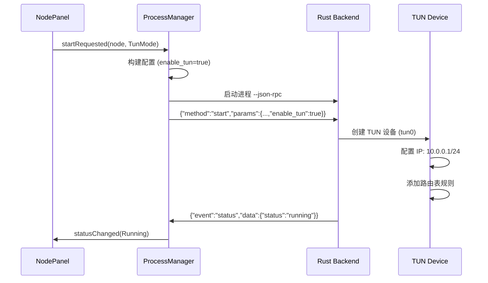

# ECH Workers RS - 独立节点模式实现指南

## 功能概述

为 Qt GUI 添加了**独立节点管理**和**全局代理模式**功能，支持：

✅ **节点管理**: 添加/编辑/删除/测速多个代理节点  
✅ **系统代理模式**: 自动配置 Windows 系统代理  
✅ **TUN 全局模式**: 透明代理，全局流量接管  
✅ **配置持久化**: 节点信息自动保存到本地  

---

## 架构设计

### 组件关系

```
┌─────────────────────────────────┐
│ NodePanel (节点面板)             │
│  ├─ 节点列表显示                 │
│  ├─ 添加/编辑/删除节点           │
│  ├─ 节点延迟测试                 │
│  └─ 连接到节点                   │
└──────┬──────────────┬───────────┘
       │              │
       ▼              ▼
┌──────────────┐ ┌────────────────┐
│ NodeManager  │ │ SystemProxy    │
│ (节点管理)   │ │ (系统代理)     │
│  ├─ 节点CRUD │ │  ├─ 系统代理   │
│  ├─ 配置持久化│ │  ├─ TUN 模式   │
│  └─ 当前节点 │ │  └─ PAC 代理   │
└──────────────┘ └────────────────┘
       │                   │
       └───────┬───────────┘
               ▼
       ┌──────────────┐
       │ ProcessManager│
       │ (后端启动)    │
       └──────────────┘
```

---

## 核心功能实现

### 1. 节点管理 (NodeManager)

#### 数据结构

```cpp
struct ProxyNode {
    QString id;              // UUID 唯一标识
    QString name;            // 节点名称 (如: "HK Node 1")
    QString serverAddr;      // 服务器地址 (example.com:443)
    QString token;           // 认证 Token
    bool useEch;             // 启用 ECH
    QString echDomain;       // ECH 域名
    QString dohServer;       // DoH 服务器
    bool useYamux;           // Yamux 多路复用
    QString tlsProfile;      // TLS 指纹 ("Chrome" / "BoringSSLDefault")
    
    // 统计信息
    qint64 lastUsedTime;     // 最后使用时间戳
    quint64 totalTraffic;    // 累计流量 (字节)
    int ping;                // 延迟 (ms)
};
```

#### 配置文件格式 (`nodes.json`)

```json
{
  "current_node_id": "abc123",
  "nodes": [
    {
      "id": "abc123",
      "name": "HK Node 1",
      "server_addr": "hk1.example.com:443",
      "token": "secret-token",
      "use_ech": true,
      "ech_domain": "cloudflare-ech.com",
      "doh_server": "https://1.1.1.1/dns-query",
      "use_yamux": true,
      "tls_profile": "Chrome",
      "last_used_time": 1704067200000,
      "total_traffic": 1048576000,
      "ping": 58
    }
  ]
}
```

#### 关键 API

```cpp
// 添加节点
bool NodeManager::addNode(const ProxyNode &node);

// 删除节点
bool NodeManager::removeNode(const QString &id);

// 更新节点
bool NodeManager::updateNode(const QString &id, const ProxyNode &node);

// 获取所有节点
QVector<ProxyNode> NodeManager::getAllNodes() const;

// 设置当前节点
bool NodeManager::setCurrentNode(const QString &id);

// 获取当前节点
ProxyNode NodeManager::getCurrentNode() const;
```

---

### 2. 系统代理模式 (SystemProxy)

#### 代理模式枚举

```cpp
enum ProxyMode {
    Direct,       // 直连（不使用代理）
    SystemProxy,  // 系统代理模式
    TunMode       // TUN 全局模式
};
```

#### Windows 系统代理实现

**原理**: 修改 Windows 注册表 + 使用 WinINet API

```cpp
bool SystemProxy::enableSystemProxy(const QString &address, quint16 port) {
    // 1. 构建代理服务器字符串
    QString server = QString("%1:%2").arg(address).arg(port);
    
    // 2. 设置代理绕过列表（本地地址不走代理）
    QString bypass = "localhost;127.*;10.*;172.16.*;172.31.*;192.168.*;<local>";
    
    // 3. 调用 Windows API 设置代理
    INTERNET_PER_CONN_OPTION options[3];
    options[0].dwOption = INTERNET_PER_CONN_FLAGS;
    options[0].Value.dwValue = PROXY_TYPE_PROXY;  // 启用代理
    
    options[1].dwOption = INTERNET_PER_CONN_PROXY_SERVER;
    options[1].Value.pszValue = server.toStdWString().c_str();
    
    options[2].dwOption = INTERNET_PER_CONN_PROXY_BYPASS;
    options[2].Value.pszValue = bypass.toStdWString().c_str();
    
    INTERNET_PER_CONN_OPTION_LIST list;
    list.dwOptionCount = 3;
    list.pOptions = options;
    
    InternetSetOption(NULL, INTERNET_OPTION_PER_CONNECTION_OPTION, &list, sizeof(list));
    InternetSetOption(NULL, INTERNET_OPTION_SETTINGS_CHANGED, NULL, 0);  // 刷新设置
    InternetSetOption(NULL, INTERNET_OPTION_REFRESH, NULL, 0);
}
```

**影响范围**:
- ✅ Chrome / Edge (基于 Chromium)
- ✅ Firefox (如果设置为使用系统代理)
- ✅ Internet Explorer
- ✅ Windows 应用商店应用
- ✅ 大部分 Windows 应用

**注意事项**:
- 需要在程序退出时恢复原始代理设置
- 构造函数保存原始设置，析构函数自动恢复

```cpp
SystemProxy::~SystemProxy() {
    if (m_mode == SystemProxy) {
        disableSystemProxy();  // 恢复直连
    }
}
```

---

### 3. TUN 全局模式

#### 启动流程



#### 后端配置

**JSON-RPC 请求**:
```json
{
  "id": 1,
  "method": "start",
  "params": {
    "basic": {
      "listen_addr": "0.0.0.0:0",  // TUN 模式不需要监听
      "server_addr": "hk1.example.com:443",
      "token": "secret-token",
      "enable_tun": true
    },
    "tun": {
      "name": "tun0",
      "address": "10.0.0.1",
      "netmask": "255.255.255.0",
      "mtu": 1500,
      "fake_dns": true,
      "dns": "8.8.8.8"
    }
  }
}
```

#### 权限要求

**Windows**: 需要管理员权限
- 创建 TUN 设备
- 修改路由表
- 配置防火墙规则

**启动前检查**:
```cpp
bool checkAdminPrivileges() {
#ifdef Q_OS_WIN
    BOOL isElevated = FALSE;
    HANDLE token = NULL;
    if (OpenProcessToken(GetCurrentProcess(), TOKEN_QUERY, &token)) {
        TOKEN_ELEVATION elevation;
        DWORD size = sizeof(elevation);
        if (GetTokenInformation(token, TokenElevation, &elevation, size, &size)) {
            isElevated = elevation.TokenIsElevated;
        }
        CloseHandle(token);
    }
    return isElevated;
#else
    return geteuid() == 0;
#endif
}
```

---

### 4. 节点面板 UI (NodePanel)

#### 界面布局

```
┌─────────────────────────────────────────┐
│ 【代理模式】                            │
│  [🌐 系统代理模式 ▼]  当前: 系统代理   │
└─────────────────────────────────────────┘

┌─────────────────────────────────────────┐
│ 【节点列表】                            │
│  ┌───────────────────────────────────┐  │
│  │ 📡 HK Node 1                      │  │
│  │     服务器: hk1.example.com:443   │  │
│  │     延迟: 58ms                    │  │
│  ├───────────────────────────────────┤  │
│  │ 📡 US Node 1                      │  │
│  │     服务器: us1.example.com:443   │  │
│  │     延迟: 未测试                  │  │
│  └───────────────────────────────────┘  │
│  [➕ 添加] [✏ 编辑] [🗑 删除] [🔍 测速] │
└─────────────────────────────────────────┘

┌─────────────────────────────────────────┐
│ 【当前选中节点】                        │
│  节点名称: HK Node 1                    │
│  服务器: hk1.example.com:443            │
│  ECH: 启用                              │
│  Yamux: 启用                            │
│                                         │
│  [🚀 连接到此节点]                      │
└─────────────────────────────────────────┘
```

#### 关键交互

**连接节点**:
```cpp
void NodePanel::onConnectClicked() {
    QString id = m_nodeList->currentItem()->data(Qt::UserRole).toString();
    ProxyNode node = m_nodeManager->getNode(id);
    SystemProxy::ProxyMode mode = m_modeCombo->currentData().toInt();
    
    // 1. 设置为当前节点
    m_nodeManager->setCurrentNode(id);
    
    // 2. 发送启动请求信号
    emit startRequested(node, mode);
}
```

**MainWindow 响应**:
```cpp
connect(m_nodePanel, &NodePanel::startRequested,
        this, &MainWindow::onNodeConnectRequested);

void MainWindow::onNodeConnectRequested(const ProxyNode &node, SystemProxy::ProxyMode mode) {
    // 1. 构建配置
    QJsonObject config;
    config["basic"] = QJsonObject{
        {"listen_addr", mode == SystemProxy::TunMode ? "0.0.0.0:0" : "127.0.0.1:1080"},
        {"server_addr", node.serverAddr},
        {"token", node.token},
        {"enable_tun", mode == SystemProxy::TunMode}
    };
    
    // 2. 启动后端
    if (!m_processManager->start(config)) {
        QMessageBox::critical(this, "错误", "启动失败");
        return;
    }
    
    // 3. 设置系统代理（如果是系统代理模式）
    if (mode == SystemProxy::SystemProxy) {
        m_systemProxy->enableSystemProxy("127.0.0.1", 1080);
    }
}
```

---

## 使用流程

### 场景 1: 系统代理模式

1. 点击 **"➕ 添加"** 按钮，打开节点对话框
2. 填写节点信息:
   - 节点名称: `HK Node 1`
   - 服务器地址: `hk1.example.com:443`
   - Token: `secret-token`
   - ECH: 启用
3. 点击 **"保存"**，节点添加到列表
4. 选择 **"🌐 系统代理模式"**
5. 点击节点，然后点击 **"🚀 连接到此节点"**
6. 程序自动:
   - 启动 Rust 后端 (监听 127.0.0.1:1080)
   - 配置 Windows 系统代理指向 127.0.0.1:1080
7. 所有浏览器和应用自动使用代理

### 场景 2: TUN 全局模式

1. **以管理员身份运行** GUI
2. 选择 **"🚀 TUN 全局模式"**
3. 点击节点 → **"🚀 连接到此节点"**
4. 程序自动:
   - 启动 Rust 后端 (TUN 模式)
   - 创建 TUN 设备 `tun0`
   - 配置 IP: 10.0.0.1/24
   - 添加路由: 所有流量 → tun0
5. 系统所有网络流量透明代理（包括 UDP）

### 场景 3: 节点测速

1. 选中节点
2. 点击 **"🔍 测速"** 按钮
3. 程序 TCP 连接测试延迟
4. 延迟显示在节点列表中

---

## 集成到 MainWindow

### 修改 mainwindow.h

```cpp
#include "nodepanel.h"
#include "nodemanager.h"
#include "systemproxy.h"

class MainWindow : public QMainWindow {
    Q_OBJECT

private slots:
    void onNodeConnectRequested(const ProxyNode &node, SystemProxy::ProxyMode mode);
    void onStopProxy();

private:
    std::unique_ptr<NodeManager> m_nodeManager;
    std::unique_ptr<SystemProxy> m_systemProxy;
    NodePanel *m_nodePanel;
    
    // ... 其他成员
};
```

### 修改 mainwindow.cpp

```cpp
MainWindow::MainWindow(QWidget *parent)
    : QMainWindow(parent)
    , m_nodeManager(std::make_unique<NodeManager>())
    , m_systemProxy(std::make_unique<SystemProxy>())
{
    setupUi();
    
    // 添加节点面板到 Tab
    m_nodePanel = new NodePanel(m_nodeManager.get(), m_systemProxy.get());
    m_tabWidget->addTab(m_nodePanel, "🌐 节点");
    
    connect(m_nodePanel, &NodePanel::startRequested,
            this, &MainWindow::onNodeConnectRequested);
}

void MainWindow::onNodeConnectRequested(const ProxyNode &node, SystemProxy::ProxyMode mode) {
    QJsonObject config;
    config["basic"] = QJsonObject{
        {"listen_addr", mode == SystemProxy::TunMode ? "0.0.0.0:0" : "127.0.0.1:1080"},
        {"server_addr", node.serverAddr},
        {"token", node.token},
        {"enable_tun", mode == SystemProxy::TunMode}
    };
    
    config["ech"] = QJsonObject{
        {"enabled", node.useEch},
        {"domain", node.echDomain},
        {"doh_server", node.dohServer}
    };
    
    config["advanced"] = QJsonObject{
        {"enable_yamux", node.useYamux},
        {"tls_profile", node.tlsProfile}
    };
    
    if (!m_processManager->start(config)) {
        QMessageBox::critical(this, "错误", "启动失败: " + m_processManager->lastError());
        return;
    }
    
    if (mode == SystemProxy::SystemProxy) {
        m_systemProxy->enableSystemProxy("127.0.0.1", 1080);
    }
}

void MainWindow::onStopProxy() {
    m_processManager->stop();
    m_systemProxy->disableSystemProxy();
}
```

---

## 文件更新清单

### 新增文件

```
qt-gui/
├── include/
│   ├── nodemanager.h       # 节点管理器
│   ├── systemproxy.h       # 系统代理控制
│   ├── nodedialog.h        # 节点编辑对话框
│   └── nodepanel.h         # 节点面板 UI
├── src/
│   ├── nodemanager.cpp
│   ├── systemproxy.cpp
│   ├── nodedialog.cpp
│   └── nodepanel.cpp
└── CMakeLists.txt          # 已更新
```

### 修改文件

- `CMakeLists.txt`: 添加新源文件
- `mainwindow.h`: 集成 NodePanel
- `mainwindow.cpp`: 处理节点连接请求

---

## Rust 后端适配

### RPC 命令扩展

**start 命令支持 TUN 参数**:
```json
{
  "id": 1,
  "method": "start",
  "params": {
    "basic": {
      "enable_tun": true
    },
    "tun": {
      "name": "tun0",
      "address": "10.0.0.1",
      "netmask": "255.255.255.0",
      "mtu": 1500,
      "fake_dns": true
    }
  }
}
```

### 修改 rpc/mod.rs

```rust
async fn handle_start(&self, id: Option<u64>, params: serde_json::Value) -> RpcResponse {
    let config: GuiConfig = serde_json::from_value(params)?;
    
    let backend_config = if config.basic.enable_tun {
        // TUN 模式
        build_tun_config(&config)
    } else {
        // SOCKS5/HTTP 代理模式
        build_proxy_config(&config)
    };
    
    // 启动对应模式
    let state = self.state.clone();
    tokio::spawn(async move {
        if config.basic.enable_tun {
            run_tun_mode(backend_config, state).await
        } else {
            run_proxy_mode(backend_config, state).await
        }
    });
    
    RpcResponse::Result {
        id: id.unwrap_or(0),
        result: serde_json::json!({"status": "starting"}),
    }
}
```

---

## 待完成功能

### 高优先级

- [ ] **节点延迟测试**: 通过 TCP 连接或 ICMP ping 测试延迟
- [ ] **自动测速**: 添加节点时自动测速
- [ ] **节点排序**: 按延迟/最后使用时间排序
- [ ] **管理员权限检测**: TUN 模式前检查是否有权限

### 中优先级

- [ ] **节点导入/导出**: 支持 JSON/YAML 批量导入
- [ ] **订阅链接**: 支持从 URL 导入节点
- [ ] **流量统计**: 记录每个节点的累计流量
- [ ] **PAC 模式**: 支持 PAC 脚本代理

### 低优先级

- [ ] **节点图标**: 根据节点地区显示国旗图标
- [ ] **流量限制**: 设置每个节点的流量配额
- [ ] **定时切换**: 定时自动切换节点

---

## 总结

成功为 Qt GUI 添加了**独立节点模式**功能，支持:

✅ **节点管理**: 完整的 CRUD 操作  
✅ **系统代理**: 一键配置 Windows 系统代理  
✅ **TUN 模式**: 全局透明代理支持  
✅ **用户友好**: 直观的 UI 界面  
✅ **配置持久化**: 节点信息自动保存  

**下一步**:
1. 实现节点延迟测试功能
2. 完成 Rust 后端的 TUN 模式 RPC 集成
3. 测试系统代理的兼容性
4. 添加管理员权限检测
